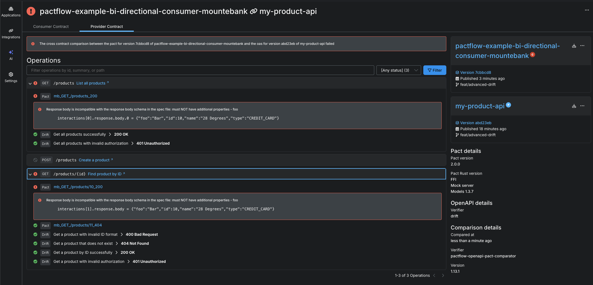
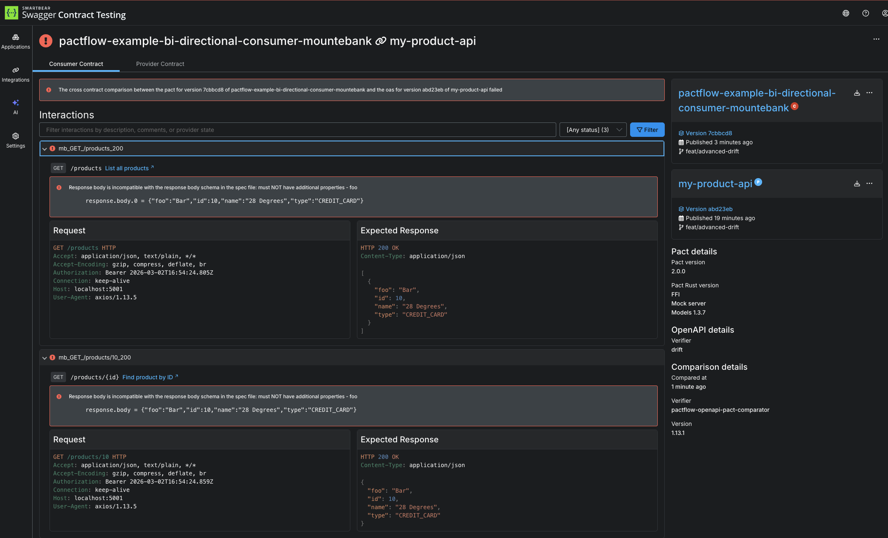

# When things go bad

So far everything has been really easy. Let's go a bit deeper and introduce a breaking change into the system. Breaking changes come in two main ways:

1. A consumer can add a new expectation (e.g. a new field/endpoint) on a provider that doesn't exist
1. A provider might make a change (e.g. remove or rename a field) that breaks an existing consumer

PactFlow will detect such situations using the `can-i-deploy` tool. When it runs, it performs a contract comparison that checks if the consumer contract is a valid subset of the provider contract in the target environment.

Let's see it in action.

## Provider breaking changes

Change directories into `cd /root/example-provider`{{execute}}

1.  Try adding a new expectation on the provider by updating the contract. First remove the 'version' property in `example-provider/src/product/product.js`{{copy}} and comment out in the oas `example-provider/openapi.yaml`{{copy}} at lines 32/55/94/124/125

    1. `git add . && git commit -m 'feat: remove version'`{{execute}}
    2. Run the following command to publish, ensuring it is run after the test run `npm run test:inmemory`{{execute}} to capture the exit code

    ```
    # Capture the exit code from Drift
    EXIT_CODE=$?

    # Find the generated verification bundle
    VERIFICATION_FILE=$(ls output/results/verification.*.result | head -n 1)

    pact pactflow publish-provider-contract \
    openapi.yaml \
    --provider "my-product-api" \
    --provider-app-version "$(git rev-parse --short HEAD)" \
    --branch "$(git rev-parse --abbrev-ref HEAD)" \
    --content-type application/yaml \
    --verification-exit-code $EXIT_CODE \
    --verification-results "$VERIFICATION_FILE" \
    --verification-results-content-type application/vnd.smartbear.drift.result \
    --verifier drift
    ```{{execute}}

    3. Run Can I Deploy to check if it's safe to deploy this change to production:

    ```
    pact broker can-i-deploy \
    --pacticipant "my-product-api" \
        --version "$(git rev-parse --short HEAD)" \
        --to-environment production
    ```{{execute}}

OK, that was a trick! Note how in the consumer's `Product` definition, it doesn't actually use the `version` field? PactFlow knows all of the consumers needs down to the field level. Because no consumer uses `version` this is a safe operation.

Reset our change `git reset --hard origin/feat/advanced-drift`{{execute}}

1.  Try changing the provider code in a way that will break it's existing consumer. For example, comment out all references to `name` in `example-provider/src/product/product.js`{{copy}} and in the oas `example-provider/openapi.yaml`{{copy}} at lines 31/54/93/114/122/123

    1. `git add . && git commit -m 'feat: remove name'`{{execute}}
    2. Run the following command to publish, ensuring it is run after the test run `npm run test:inmemory`{{execute}} to capture the exit code

    ```
    # Capture the exit code from Drift
    EXIT_CODE=$?

    # Find the generated verification bundle
    VERIFICATION_FILE=$(ls output/results/verification.*.result | head -n 1)

    pact pactflow publish-provider-contract \
    openapi.yaml \
    --provider "my-product-api" \
    --provider-app-version "$(git rev-parse --short HEAD)" \
    --branch "$(git rev-parse --abbrev-ref HEAD)" \
    --content-type application/yaml \
    --verification-exit-code $EXIT_CODE \
    --verification-results "$VERIFICATION_FILE" \
    --verification-results-content-type application/vnd.smartbear.drift.result \
    --verifier drift
    ```{{execute}}

    3. Run Can I Deploy to check if it's safe to deploy this change to production:

    ```
    pact broker can-i-deploy \
    --pacticipant "my-product-api" \
        --version "$(git rev-parse --short HEAD)" \
        --to-environment production
    ```{{execute}}

    You should have an output like below

```
✗ pact broker can-i-deploy   --pacticipant "my-product-api"     --version "$(git rev-parse --short HEAD)"     --to-environment production
┌─────────────────────────────────────────────────────┬───────────┬────────────────┬───────────┬──────────┬────────┐
│ CONSUMER                                            ┆ C.VERSION ┆ PROVIDER       ┆ P.VERSION ┆ SUCCESS? ┆ RESULT │
╞═════════════════════════════════════════════════════╪═══════════╪════════════════╪═══════════╪══════════╪════════╡
│ pactflow-example-bi-directional-consumer-mountebank ┆ 7cbbcd8   ┆ my-product-api ┆ 309a813   ┆ false    ┆ 1      │
└─────────────────────────────────────────────────────┴───────────┴────────────────┴───────────┴──────────┴────────┘

VERIFICATION RESULTS
--------------------
1. https://test.pactflow.io/contracts/bi-directional/provider/my-product-api/version/309a813/consumer/pactflow-example-bi-directional-consumer-mountebank/version/7cbbcd8/cross-contract-verification-results (failure)


The cross contract comparison between the pact for one of the versions of pactflow-example-bi-directional-consumer-mountebank currently in production (7cbbcd8) and the oas for version 309a813 of my-product-api failed


❌ Computer says no ¯\_(ツ)_/¯
❌ No deployable version found
```

Head into the PactFlow UI and drill down into the "contract comparison" tab, you'll see the output from comparing the consumer and provider contracts:


As you can see, it's alerting us to the fact that the consumer needs a field `name` but the provider doesn't support it.

Read more about how to [interpret failures](https://docs.pactflow.io/docs/bi-directional-contract-testing/compatibility-checks).

## Consumer breaking changes

Change directories into your consumer project: `cd /root/example-bi-directional-consumer-mountebank`{{execute}}

1.  Try adding a new expectation on the provider by updating the contract. For example, add a new property to the `expectedProduct` field in `example-bi-directional-consumer-mountebank/src/api.spec.js`{{copy}}:

    ```
    const expectedProduct = {
        id: "10",
        type: "CREDIT_CARD",
        name: "28 Degrees",
        foo: "bar"
    };
    ```

    1. `git add . && git commit -m 'feat: add foo'`{{execute}}
    2. `npm t`{{execute}}
    3. Publish the pact files

    ```
    pact broker publish \
    pacts \
    --consumer-app-version "$(git rev-parse --short HEAD)" \
    --branch "$(git rev-parse --abbrev-ref HEAD)"
    ```{{execute}}


    4. Run Can I Deploy to check if it's safe to deploy this change to production:

    ```
    pact broker can-i-deploy \
    --pacticipant "pactflow-example-bi-directional-consumer-mountebank" \
        --version "$(git rev-parse --short HEAD)" \
        --to-environment production
    ```{{execute}}


    You shouldn't be able to deploy!

```
✗ pact broker can-i-deploy     --pacticipant "pactflow-example-bi-directional-consumer-mountebank"         --version "$(git rev-parse --short HEAD)" --branch feat/advanced-drift         --to-environment production
┌─────────────────────────────────────────────────────┬───────────┬────────────────┬───────────┬──────────┬────────┐
│ CONSUMER                                            ┆ C.VERSION ┆ PROVIDER       ┆ P.VERSION ┆ SUCCESS? ┆ RESULT │
╞═════════════════════════════════════════════════════╪═══════════╪════════════════╪═══════════╪══════════╪════════╡
│ pactflow-example-bi-directional-consumer-mountebank ┆ 7cbbcd8   ┆ my-product-api ┆ 309a813   ┆ false    ┆ 1      │
└─────────────────────────────────────────────────────┴───────────┴────────────────┴───────────┴──────────┴────────┘

VERIFICATION RESULTS
--------------------
1. https://test.pactflow.io/contracts/bi-directional/provider/my-product-api/version/309a813/consumer/pactflow-example-bi-directional-consumer-mountebank/version/7cbbcd8/cross-contract-verification-results (failure)


The cross contract comparison between the pact for one of the versions of pactflow-example-bi-directional-consumer-mountebank currently in production (7cbbcd8) and the oas for version 309a813 of my-product-api failed


❌ Computer says no ¯\_(ツ)_/¯
❌ No deployable version found
```

As per the previous failure, you can see it's alerting us to the fact that the consumer needs a field `foo` but the provider doesn't support it.

The consumer won't be able to release this change until the Provider API supports it.





## Check your understanding

1. It is always safe to remove a field from a provider, if no consumers are currently using it
1. It is not safe to remove a field/endpoint from a provider, if an existing consumer _is_ using it, and PactFlow will detect this situation.
1. PactFlow will prevent a consumer from deploying a change that a Provider has yet to support

