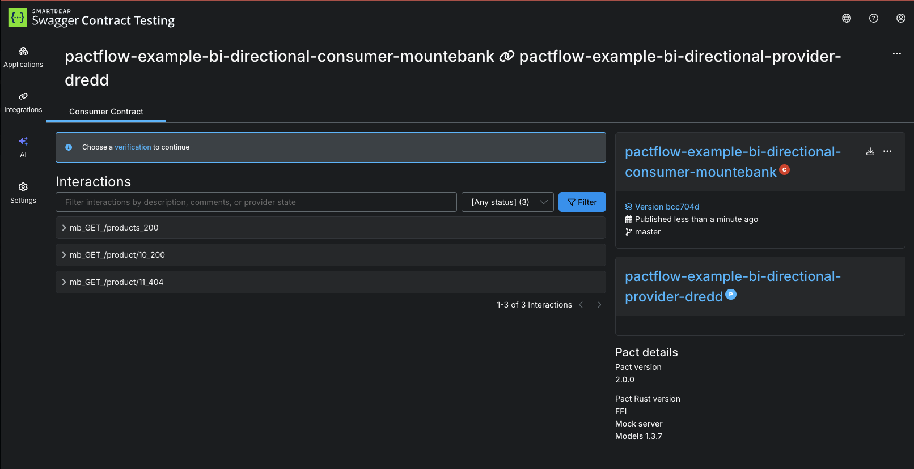

# Publish the provider contract to Pactflow

Now that we have created and verified our provider contract, we need to share the contract to our consumers. This is where Pactflow comes in to the picture. This step is referred to as "publishing" the provider contract.

The publishing step takes two key components:

- The provider contract itself (in our case, the OAS document)
- The test results (in our case, the Dredd output and whether or not it passed)

This information will be helpful later on, when we need to check compatibility with its consumers.

1. Go to Pactflow and copy your [read/write API Token](https://docs.pactflow.io/docs/getting-started/#configuring-your-api-token)
1. Export these two environment variables into the terminal, being careful to replace the placeholders with your own values:

   ```
   export PACT_BROKER_BASE_URL=https://YOUR_PACTFLOW_SUBDOMAIN.pactflow.io
   export PACT_BROKER_TOKEN=YOUR_API_TOKEN
   ```

1. Set the application version `export GIT_COMMIT="$(git rev-parse --short HEAD)"`{{execute}}
1. `npm run test:publish`{{execute}}
1. Go to your Pactflow dashboard and check that a new contract has appeared

Your dashboard should look something like this:

TBC



## Don't have a Pactflow account?

If you don't have a Pactflow account, you can publish a [test broker](https://test.pactflow.io) that uses the [open source pact broker](https://github.com/pact-foundation/pact_broker/).

````
export PACT_BROKER_BASE_URL=https://test.pactflow.io
export PACT_BROKER_TOKEN=dXfltyFMgNOFZAxr8io9wJ37iUpY42M
export PACT_BROKER_TOKEN=129cCdfCWhMzcC9pFwb4bw
```{{execute}}

The account is protected using basic auth. Use the username `dXfltyFMgNOFZAxr8io9wJ37iUpY42M`, and password `O5AIZWxelWbLvqMd8PkAVycBJh2Psyg1` to view the pacts.

````
