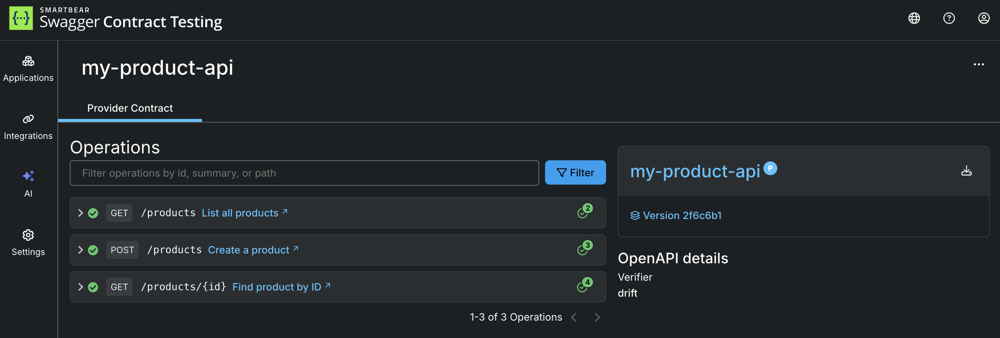
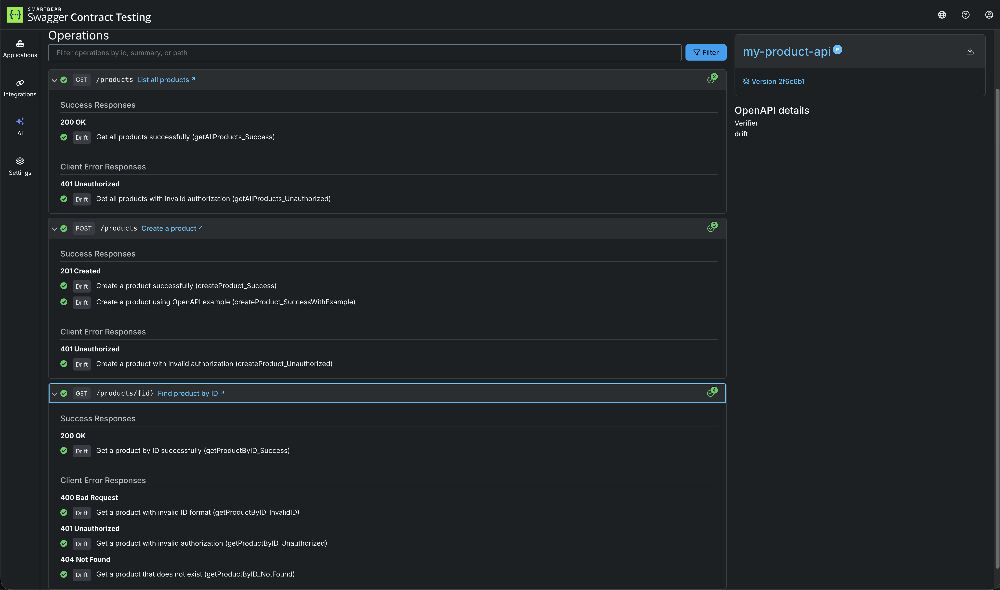

# Publish the provider contract to PactFlow

Now that we have created and verified our provider contract, we need to share the contract to our consumers. This is where PactFlow comes in to the picture. This step is referred to as "publishing" the provider contract.

The publishing step takes two key components:

- The provider contract itself (in our case, the OAS document)
- The test results (in our case, the Drift output and whether or not it passed)

This information will be helpful later on, when we need to check compatibility with its consumers.

Traditionally this would be setup as part of a CI/CD pipeline, where you run your API tests, and then publish the contract and test results to PactFlow as part of the same pipeline. For the purposes of this workshop, we're going to run these steps manually.

1. Go to PactFlow and copy your [read/write API Token](https://docs.pactflow.io/#configuring-your-api-token) as `as Environment Variables`
2. Export these two environment variables into the terminal, being careful to replace the placeholders with your own values:

   ```
   export PACT_BROKER_BASE_URL=https://YOUR_PACTFLOW_SUBDOMAIN.pactflow.io
   export PACT_BROKER_TOKEN=YOUR_API_TOKEN
   ```
3. `echo $PACT_BROKER_BASE_URL`{{execute}} This should return your base url
4. `echo $PACT_BROKER_TOKEN`{{execute}} This should return your token, you can now move on
5. `ls -la output/results/verification.*.result`{{execute}} to list your test report
6. `curl -fsSL https://raw.githubusercontent.com/pact-foundation/pact-cli/main/install.sh | sh`{{execute}} to install the [Pact CLI](https://docs.pact.io/implementation_guides/cli#pact---all-in-one-cli)
7. `mv ./pact /usr/local/bin/`{{execute}} to move the Pact CLI to a location on your PATH
8. Run the following command to publish, ensuring it is run after the test run `npm run test:inmemory`{{execute}} to capture the exit code
```
# Capture the exit code from Drift
EXIT_CODE=$?

# Find the generated verification bundle
VERIFICATION_FILE=$(ls output/results/verification.*.result | head -n 1)

pact pactflow publish-provider-contract \
openapi.yaml \
  --provider "pactflow-example-bi-directional-provider-drift" \
  --provider-app-version "$(git rev-parse --short HEAD)" \
  --branch "$(git rev-parse --abbrev-ref HEAD)" \
  --content-type application/yaml \
  --verification-exit-code $EXIT_CODE \
  --verification-results "$VERIFICATION_FILE" \
  --verification-results-content-type application/vnd.smartbear.drift.result \
  --verifier drift
```{{execute}}

You should see output similar to this:

```
📨 Attempting to publish provider contract for provider: pactflow-example-bi-directional-provider-drift version: 2f6c6b1
✅ Created pactflow-example-bi-directional-provider-drift version 2f6c6b1 with branch main
Provider contract published for pactflow-example-bi-directional-provider-drift version 2f6c6b1 with successful self verification results.
View the published provider contract at https://test.pactflow.io/contracts/bi-directional/provider/pactflow-example-bi-directional-provider-drift/version/2f6c6b1/provider-contract-verification-results
Next steps:
* Check your application is safe to deploy - https://docs.pact.io/can_i_deploy
$ pact-broker can-i-deploy --pacticipant pactflow-example-bi-directional-provider-drift --version 2f6c6b1 --to-environment <your environment name>
* Record deployment or release to specified environment (choose one) - https://docs.pact.io/go/record-deployment
$ pact-broker record-deployment --pacticipant pactflow-example-bi-directional-provider-drift --version 2f6c6b1 --environment <your environment name>
$ pact-broker record-release --pacticipant pactflow-example-bi-directional-provider-drift --version 2f6c6b1 --environment <your environment name>
```

1. Go to your PactFlow dashboard, by clicking on the link in the terminal output

Your dashboard should look something like this:



You can expand the contract to see more details, including the test results and the OAS document that was published.



## Check

There should be a contract published in your PactFlow account before moving on.
