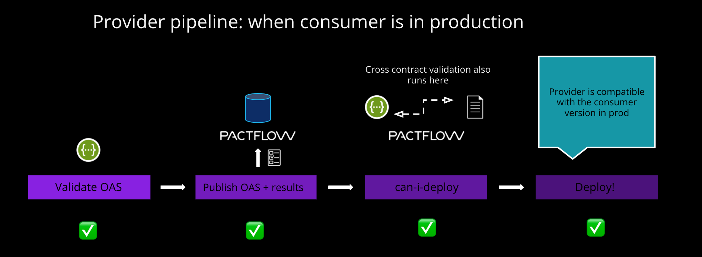
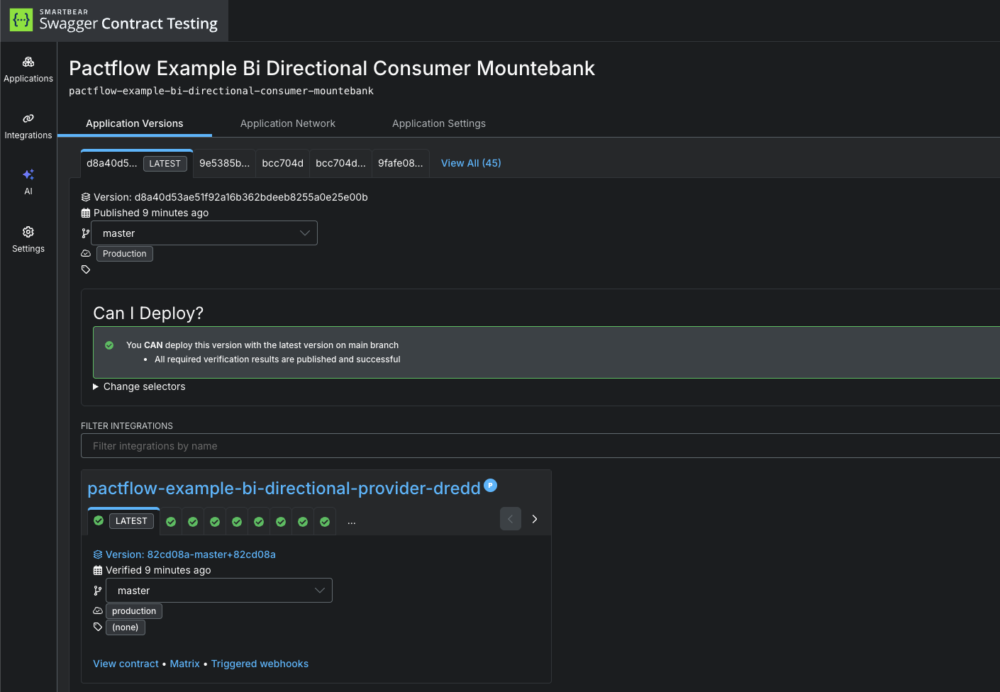

# Deploy the provider

Now that we have tested our provider and published our provider contract, we can deploy the application to production.

Whilst we don't currently have any consumers to worry about, we want to be prepared for when we do. Pactflow has a tool called [`can-i-deploy`](https://docs.pact.io/pact_broker/can_i_deploy) to help us.

The `can-i-deploy` command is an important part of a CI/CD workflow, adding stage gates to prevent deploying incompatible applications to environments such as production.

This diagram shows an illustrative CI/CD pipeline as it relates to our progress to date:



Let's run the command:

`npx pact-broker can-i-deploy --pacticipant pactflow-example-provider-dredd --version $GIT_COMMIT --to-environment production`{{execute}}

This should pass, because as we discussed above, there are no consumers:

```
$ npx pact-broker can-i-deploy --pacticipant pactflow-example-provider-dredd --version $GIT_COMMIT --to-environment production
Computer says yes \o/

There are no missing dependencies
```

Later on, when consumers start to use our API, we will be prevented from releasing a change that results in a backwards incompatible change for our consumers. Consumers will also use this command to ensure they are compatible with the Provider API in the target environment (in this case, `production`).

We can now deploy our provider to production. Once we have deployed, we let Pactflow know that the new version of the Provider has been promoted to that environment:

`npx pact-broker record-deployment --pacticipant pactflow-example-provider-dredd --version $GIT_COMMIT --environment production`{{execute}}

# Check

Your dashboard should look something like this, where both your consumer and provider are marked as having been deployed to `production`:

TBC



<!-- ## Deploy

So we've created our consumer, published the contract and now it's time to deploy to production!

Before we do, however, we can check if this is safe to do:

`npm run can-deploy:consumer`{{execute}}

You should see the following output:

```

> npx pact-broker can-i-deploy --pacticipant katacoda-consumer --version 1.0.0-someconsumersha --to prod

Computer says no ¯\_(ツ)\_/¯

| CONSUMER          | C.VERSION             | PROVIDER          | P.VERSION | SUCCESS? |
| ----------------- | --------------------- | ----------------- | --------- | -------- |
| katacoda-consumer | 1.0.0-someconsumersha | katacoda-provider | ???       | ???      |

There is no verified pact between version 1.0.0-someconsumersha of katacoda-consumer and the latest version of katacoda-provider with tag prod (no such version exists)

```

Oh oh! We can't deploy yet, because our Provider has yet to be created, let alone confirm if it can satisfy our needs.

The `can-i-deploy` command is an important part of a CI/CD workflow, adding stage gates to prevent deploying incompatible applications to environments such as production.

This diagram shows an illustrative CI/CD pipeline as it relates to our progress to date:


## Check

There should be a contract published in your Pactflow account before moving on -->

```

```
