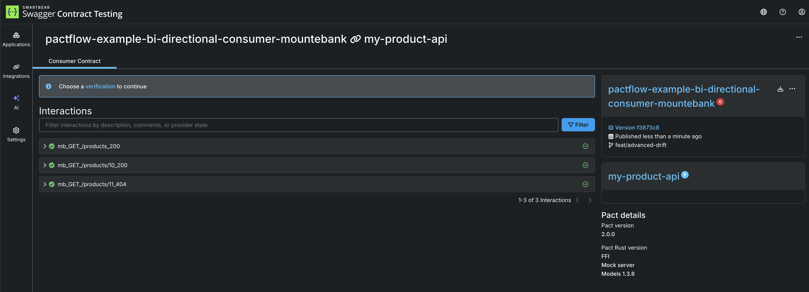
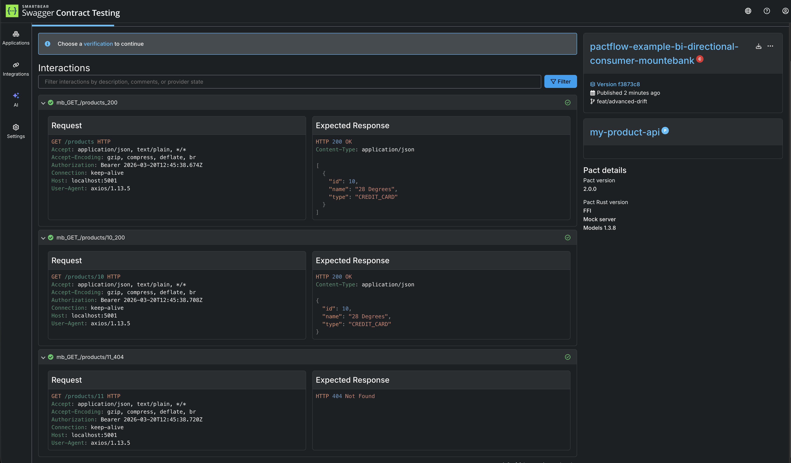
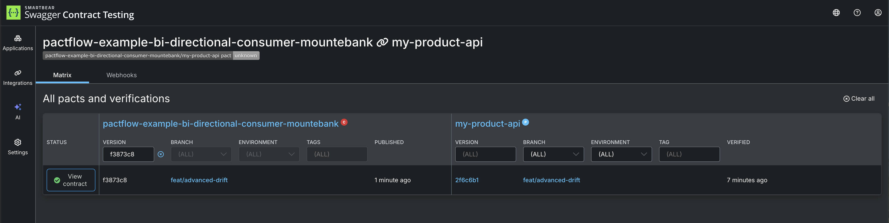
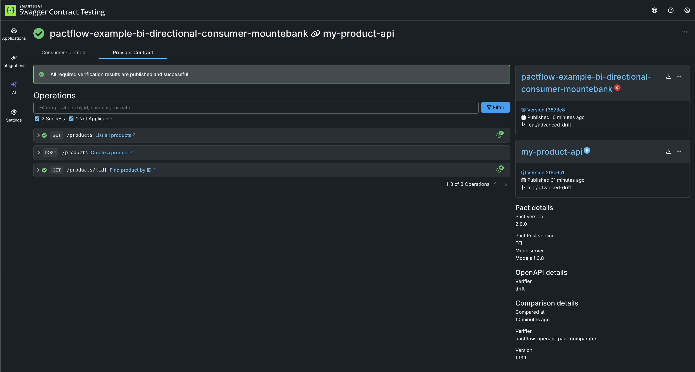

# Publish consumer contract to PactFlow

Now that we have created our consumer contract, we need to share it to our provider. This is where PactFlow comes in to the picture. This step is referred to as "publishing" the consumer contract.

As per step 4, we're going to need credentials to our PactFlow account here:

_NOTE: if step 1 and 2 return a value you can move to step 5

1. `echo $PACT_BROKER_BASE_URL`{{execute}}  
2. `echo $PACT_BROKER_TOKEN`{{execute}} 
3. Go to PactFlow and copy your [read/write API Token](https://docs.pactflow.io/#configuring-your-api-token)
4. Export these two environment variables into the terminal, being careful to replace the placeholders with your own values:

   ```
   export PACT_BROKER_BASE_URL=https://YOUR_PACTFLOW_SUBDOMAIN.pactflow.io
   export PACT_BROKER_TOKEN=YOUR_API_TOKEN
   ```

5. Publish the pact files

```
pact broker publish \
pacts \
  --consumer-app-version "$(git rev-parse --short HEAD)" \
  --branch "$(git rev-parse --abbrev-ref HEAD)"
```{{execute}}

You should see output similar to this:

```
📨 Attempting to publish pact for consumer: pactflow-example-bi-directional-consumer-mountebank against provider: my-product-api
✅ Updated pactflow-example-bi-directional-consumer-mountebank version bcc704d with branch master
Pact successfully published for pactflow-example-bi-directional-consumer-mountebank version bcc704d and provider my-product-api.
View the published pact at https://test.pactflow.io/pacts/provider/my-product-api/consumer/pactflow-example-bi-directional-consumer-mountebank/version/bcc704d
Events detected: contract_published, contract_requiring_verification_published, contract_content_changed (first time untagged pact published)
No enabled webhooks found for the detected events
Next steps:
* Add Pact verification tests to the my-product-api build. See https://docs.pact.io/go/provider_verification
```

1. Go to your PactFlow dashboard and check that a new contract has appeared

Your dashboard should look something like this:



You can expand the contract to see more details, including the request and response that were captured in the contract.



If you select the "Choose a verification to continue" button, you will be taken to the Broker Matrix, where you can see the status of the verification for this contract. The consumer contract is automatically verified against the provider contract (the OpenAPI document), after it is published.



Clicking on the "View contract" button on your selected row, will provide detail of the

- consumer contract and content
- provider contract and content
- provider self-verification results (comparing the provider API to the OpenAPI document with API Drift testing)
- cross-verification results (comparing the Pact to the OpenAPI document with Bi-Directional contract testing)



## Check

There should be a contract published in your PactFlow account before moving on.