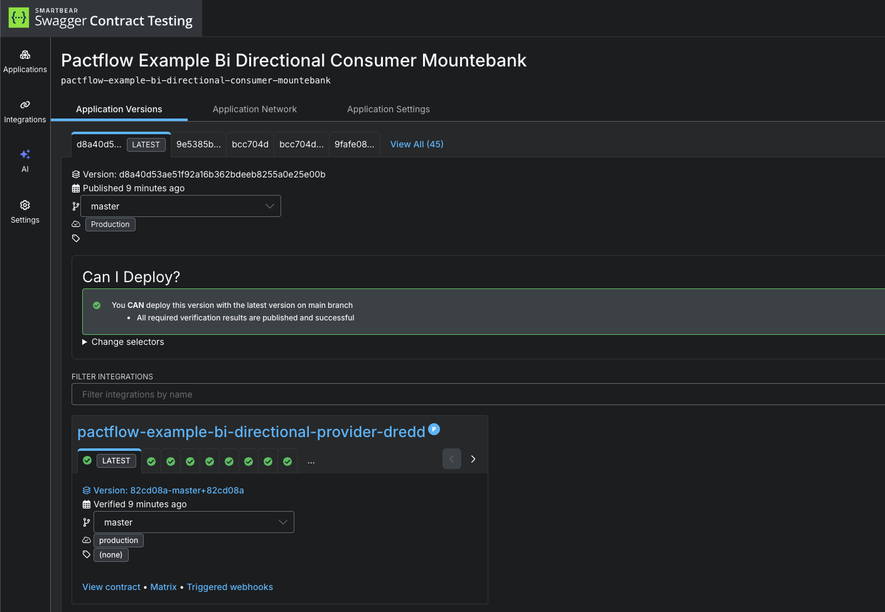

# Deploy the consumer

Now that we have tested our consumer and published our consumer contract, we can deploy the application to production.

Just like our provider counterpart, we're going to call `can-i-deploy` to check if it's safe before we do.

_REMEMBER: The `can-i-deploy` command is an important part of a CI/CD workflow, adding stage gates to prevent deploying incompatible applications to environments such as production_

<!-- This diagram shows an illustrative CI/CD pipeline as it relates to our progress to date:

 -->

Let's run the command:

```
pact broker can-i-deploy \
  --pacticipant "pactflow-example-bi-directional-consumer-mountebank" \
    --version "$(git rev-parse --short HEAD)" \
    --to-environment production
```{{execute}}

This should pass, because the provider has already pulbished its contract and deployed to production, and we believe the consumer is compatible with the provider OAS:

```
$ pact broker can-i-deploy \
   --pacticipant "pactflow-example-bi-directional-consumer-mountebank" \
     --version "$(git rev-parse --short HEAD)" \
     --to-environment production
┌─────────────────────────────────────────────────────┬───────────┬────────────────┬───────────┬──────────┬────────┐
│ CONSUMER                                            ┆ C.VERSION ┆ PROVIDER       ┆ P.VERSION ┆ SUCCESS? ┆ RESULT │
╞═════════════════════════════════════════════════════╪═══════════╪════════════════╪═══════════╪══════════╪════════╡
│ pactflow-example-bi-directional-consumer-mountebank ┆ f3873c8   ┆ pactflow-example-bi-directional-provider-drift ┆ 27ae6a6   ┆ true     ┆ true   │
└─────────────────────────────────────────────────────┴───────────┴────────────────┴───────────┴──────────┴────────┘
All required verification results are published and successful
✅ Computer says yes \o/
```

We can now deploy our consumer to production. Once we have deployed, we let PactFlow know that the new version of the consumer has been promoted to that environment:

```
pact broker record-deployment \
  --pacticipant "pactflow-example-bi-directional-consumer-mountebank" \
    --version "$(git rev-parse --short HEAD)" \
    --environment production
```{{execute}}

Which should show the output similar to this:

```
pact broker record-deployment \
   --pacticipant "pactflow-example-bi-directional-consumer-mountebank" \
     --version "$(git rev-parse --short HEAD)" \
     --environment production
✅ Recorded deployment of pactflow-example-bi-directional-consumer-mountebank version f3873c8 to production environment in the Pact Broker.
```

This allows PactFlow to prevent any providers from deploying an incompatible change to `production`.

# Check

Your dashboard should look something like this, where both your consumer and provider are marked as having been deployed to `production`:


