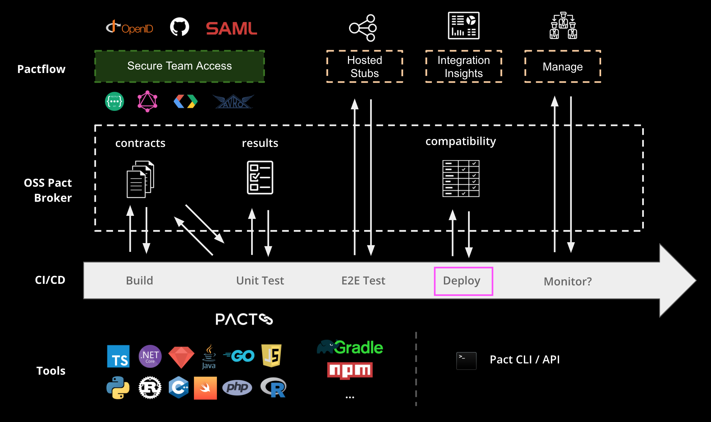

## An example scenario: Product API

We will continue working through our example scenario authoring a Pact test between a consumer (Product Web) and its provider (the Product API).

Whilst we will be building on the previous example, today's focus will be on the "deploy" step of your CI/CD pipeline and how Pactflow can help you release faster and safer, by gating the release step and providing visbility into which applications have been deployed to which environment, and what versions are compatible with one another.

## Tools

The key tool we'll be learning today is the `pact-broker` CLI tool, centered around the [`can-i-deploy`](https://docs.pact.io/pact_broker/can_i_deploy) command. Pact JS bundles the Pact CLI tools into its package automatically, but they can also be downloaded as a standalone package, or as a docker container for other languages.

See more here https://docs.pact.io/implementation_guides/cli/#pact-cli