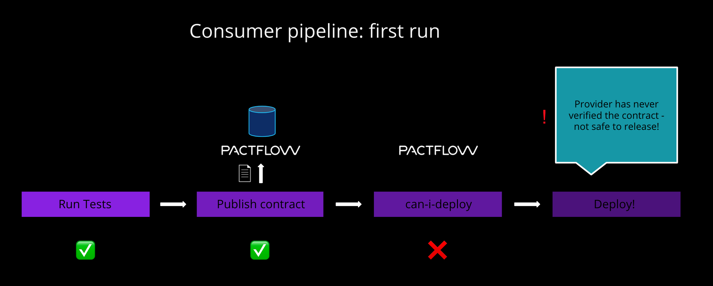

# Publish to Pactflow

Now that we have created our contract, we need to share the contract to our provider. This is where Pactflow comes in to the picture. This step is referred to as "publishing" the pact.

1. Go to Pactflow and copy your [read/write API Token](https://docs.pactflow.io/#configuring-your-api-token)
1. Export these two environment variables into the terminal, being careful to replace the placeholders with your own values:

    ```
    export PACT_BROKER_BASE_URL=https://YOUR_PACTFLOW_SUBDOMAIN.pactflow.io
    export PACT_BROKER_TOKEN=YOUR_API_TOKEN
    ```

1. `npm run publish`{{execute}}
1. Go to your Pactflow dashboard and check that a new contract has appeared

Your dashboard should look something like this:


Note the pact is currently "unverified" because the provider has ever confirmed it can fulfill the contract. It has been tagged as "master" to indicate it's the latest contract for this current consumer. We'll use [tags](https://docs.pact.io/pact_broker/tags/) to indicate which environment an application is in at any given time.

## Don't have a Pactflow account?

If you don't have a Pactflow account, you can publish a [test broker](https://test.pactflow.io) that uses the [open source pact broker](https://github.com/pact-foundation/pact_broker/).

```
export PACT_BROKER_BASE_URL=https://test.pactflow.io
export PACT_BROKER_USERNAME=dXfltyFMgNOFZAxr8io9wJ37iUpY42M
export PACT_BROKER_PASSWORD=O5AIZWxelWbLvqMd8PkAVycBJh2Psyg1
```{{execute}}

The account is protected using basic auth. Use the username `dXfltyFMgNOFZAxr8io9wJ37iUpY42M`, and password `O5AIZWxelWbLvqMd8PkAVycBJh2Psyg1` to view the pacts.

## Deploy

So we've created our consumer, published the contract and now it's time to deploy to production!

Before we do, however, we can check if this is safe to do:

`npm run can-deploy:consumer`{{execute}}

You should see the following output:

```
> npx pact-broker can-i-deploy --pacticipant katacoda-consumer --version 1.0.0-someconsumersha --to prod

Computer says no ¯\_(ツ)_/¯

CONSUMER          | C.VERSION             | PROVIDER          | P.VERSION | SUCCESS?
------------------|-----------------------|-------------------|-----------|---------
katacoda-consumer | 1.0.0-someconsumersha | katacoda-provider | ???       | ???

There is no verified pact between version 1.0.0-someconsumersha of katacoda-consumer and the latest version of katacoda-provider with tag prod (no such version exists)
```

Oh oh! We can't deploy yet, because our Provider has yet to be created, let alone confirm if it can satisfy our needs.

The `can-i-deploy` command is an important part of a CI/CD workflow, adding stage gates to prevent deploying incompatible applications to environments such as production.

This diagram shows an illustrative CI/CD pipeline as it relates to our progress to date:



## Check

There should be a contract published in your Pactflow account before moving on