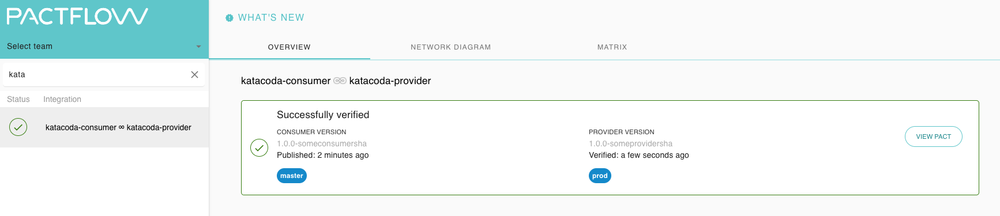

# Testing (Verify) the provider

Now that we published our contract, we can have the provider verify it each time the provider build runs, to prevent introducing breaking changes to their consumers. This is referred to as "provider verification".

_NOTE: Credentials from the previous step will be required for this step to run._

#### Run the Provider tests

This step involves the following:

1. Starting the API \(line 5\)
1. Telling Pact to use the contracts stored in Pactflow and where the Product API will be running \(lines 8-16\)
1. Running the Provider verification task \(line 18\)

Create our Provider pact test file `provider.pact.spec.js`:

filename: `provider.pact.spec.js`:

```js
echo 'const { Verifier } = require("@pact-foundation/pact");
const { server } = require("./provider");

describe("Pact Verification", () => {
  before((done) => server.listen(8081, done));

  it("validates the expectations of ProductService", () => {
    const opts = {
      logLevel: "INFO",
      providerBaseUrl: "http://localhost:8081",
      providerVersion: "1.0.0-someprovidersha",
      provider: "katacoda-provider",
      consumerVersionSelectors: [
        { tag: "master", latest: true },
        { tag: "prod", latest: true },
      ],
      pactBrokerUrl: process.env.PACT_BROKER_BASE_URL,
      publishVerificationResult: true,
      enablePending: true,
    };

    return new Verifier(opts).verifyProvider().then((output) => {
      console.log("Pact Verification Complete!");
      console.log(output);
    });
  });
});' > provider.pact.spec.js
```{{exec}}

And then run it: `npm run test:provider`{{execute}}

## Deploy

Now we've created our provider and confirmed it can meet the needs of its consumers, we can deploy it to production!

As with the consumer, we can first check if this is safe to do: `npm run can-deploy:provider`{{execute}}

Great! Because the Provider meets the needs of the consumer (and the consumer is not yet in production) it is safe to do.

Deploy the provider: `npm run deploy:provider`{{execute}}

_REMINDER: The `can-i-deploy` command is an important part of a CI/CD workflow, adding stage gates to prevent deploying incompatible applications to environments such as production_

This diagram shows an illustrative CI/CD pipeline as it relates to our progress to date:


## Check

Your dashboard should look something like this, where your provider has been tagged as having been deployed to `prod`:


```
