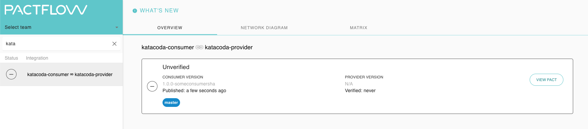

# Publish to Pactflow

Now that we have created our contract, we need to share the contract to our provider. This is where Pactflow comes in to the picture. This step is referred to as "publishing" the pact.

We're going to use the Pact [CLI Tools](https://docs.pact.io/implementation_guides/cli) for this purpose.

1. Go to Pactflow and copy your [read/write API Token](https://docs.pactflow.io/#configuring-your-api-token)
1. Export these three environment variables into the terminal, being careful to replace the placeholders with your own values:

   ```
   export PACT_BROKER_HOST=YOUR_PACTFLOW_SUBDOMAIN.pactflow.io
   export PACT_BROKER_BASE_URL=https://YOUR_PACTFLOW_SUBDOMAIN.pactflow.io
   export PACT_BROKER_TOKEN=YOUR_API_TOKEN
   ```

1. `pact-broker publish $(pwd)/build/pacts --consumer-app-version ${COMMIT} --branch ${BRANCH}`{{execute}}
1. Go to your Pactflow dashboard and check that a new contract has appeared

Your dashboard should look something like this:



Note the pact is currently "unverified" because the provider has never confirmed it can fulfill the contract.

## Versioning

Note that in our publish script, we have set the following environment variables to replicate a CI-like build behaviour:

- `VERSION` - current git sha as the application version
- `BRANCH` - current git branch to determine feature being developed

This ensures that each pact is published with unique versioning information, as well as describes where the current application has been deployed (in our case, we are in the `master` branch and it's yet to be deployed).

When pacts and verification results are published, we set the "branch" and property for the application "version".

Read more about [branches](https://docs.pact.io/pact_broker/branches/) in Pact.
Read more about [versioning](https://docs.pact.io/getting_started/versioning_in_the_pact_broker/)

When an application version is deployed or released, we use the `record-deployment` or `record-release` commands provided by the Pact Broker CLI to indicate which environment an application is in at any given time.

Read more about [Recording deployments and releases](https://docs.pact.io/pact_broker/recording_deployments_and_releases)
