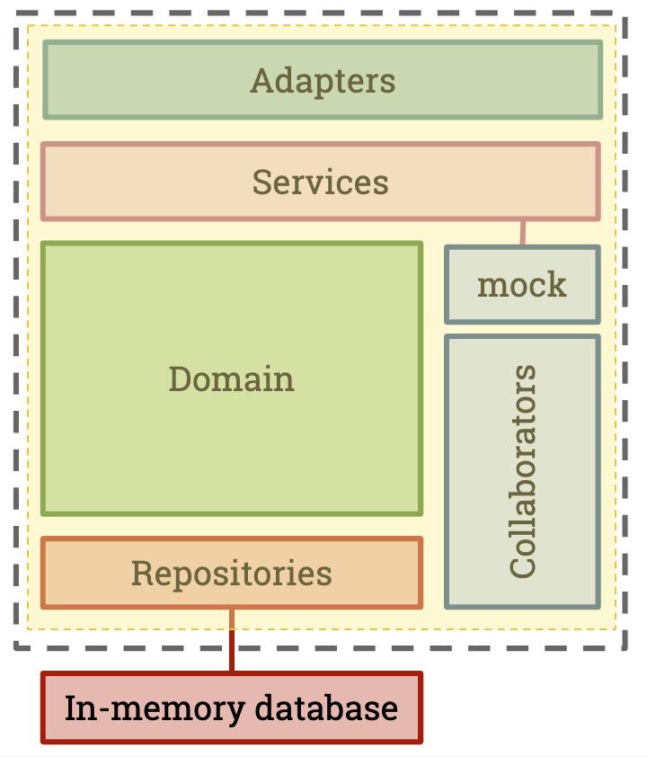
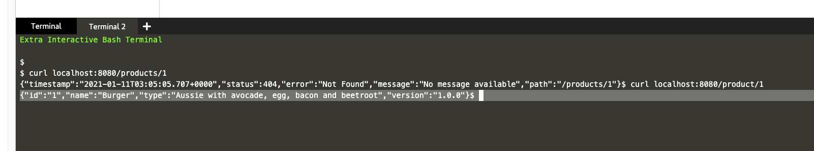

## The Provider

### Scope of a Provider pact test

On the Provider side, Pact needs to replay all of the interactions \(usually HTTP requests\) against your service. There are a number of choices that can be made here, but usually these are the choices:

- Invoke just the controller layer \(in an MVC app, or the "Adapter" in our diagram\) and stub out layers beneath
- Choosing a real vs mocked out database
- Choosing to hit mock HTTP servers or mocks for external services

Generally speaking, we test the entire service and mock out external services such as downstream APIs \(which would need their own set of Pact tests\) and databases. This gives you some of the benefits of an integration test without the high costs of maintenance.

This is how you might visualise the coverage of a provider Pact test:



### Create a new Project

We are going to be using Gradle as our build system, however you are free to use whatever build tool that you prefer (we support several other tools such as Maven and SBT). Open up the file `example-provider-springboot/build.gradle`{{copy}}

1. Click the filename above to copy.
2. Ensure the `editor` tab is open
3. press `ctrl+p` or `command+p` to search for a file
4. Press `ctrl+v` or `command+v` to paste the filename and select the file from the list to look at the dependencies needed for our project.

```
plugins {
	id 'org.springframework.boot' version '2.2.2.RELEASE'
	id 'io.spring.dependency-management' version '1.0.8.RELEASE'
	id 'java'
  id "au.com.dius.pact" version "4.1.0"
}

group = 'com.example'
version = '0.0.1-SNAPSHOT'
sourceCompatibility = '11'

repositories {
	mavenCentral()
}

configurations {
  compileOnly {
    extendsFrom annotationProcessor
  }
}

dependencies {
	implementation 'org.springframework.boot:spring-boot-starter-web'
	implementation 'org.springframework.boot:spring-boot-starter-data-jpa'
	testCompile 'au.com.dius.pact.provider:junit:4.1.8'
	testCompile 'au.com.dius.pact.provider:junit5:4.1.8'
	testCompile 'au.com.dius.pact.provider:spring:4.1.8'

	runtimeOnly 'com.h2database:h2'
  compileOnly 'org.projectlombok:lombok'
  annotationProcessor 'org.projectlombok:lombok'
	testImplementation('org.springframework.boot:spring-boot-starter-test') {
		exclude group: 'org.junit.vintage', module: 'junit-vintage-engine'
	}
}

test {
	useJUnitPlatform()

	// These properties need to be set on the test JVM process
	systemProperty("pact.provider.version", System.getenv("TRAVIS_COMMIT") == null ? "" : System.getenv("TRAVIS_COMMIT"))
	systemProperty("pact.provider.tag", System.getenv("TRAVIS_BRANCH") == null ? "" : System.getenv("TRAVIS_BRANCH"))
	systemProperty("pact.verifier.publishResults", System.getenv("PACT_BROKER_PUBLISH_VERIFICATION_RESULTS") == null ? "false" : "true")
}
```

Install dependencies for the project by running `./gradlew`{{execute}}

(click on the highlighted command above to run `./gradlew` automatically in the terminal window to the right. Again, look out for these as we progress through the workshop)

Note the system properties at the bottom of the gradle file are used to configure dynamic aspects of the build. See https://docs.pact.io/implementation_guides/jvm/provider/junit for more.

### Create the Product API

We are going to use Spring Boot for our API. Spring is beyond the scope of this tutorial, so we will simply focus on the target of our test - which is the `/product/:id` route.

Here is our (abbreviated) REST controller `/root/example-provider-springboot/src/main/java/com/example/springboot/ProductController.java`{{copy}}

1. Click the filename above to copy.
2. Ensure the `editor` tab is open
3. Click on the path above to copy it, press `ctrl+p` or `command+p` to search for a file
4. Press `ctrl+v` or `command+v` to paste the filename and select the file from the list

```
@RestController
@CrossOrigin(origins = { "*" })
@RequestMapping(value = "/", produces = "application/json; charset=utf-8")
class ProductController {

  private final ProductRepository repository;

  ProductController(ProductRepository repository) {
    this.repository = repository;
  }

  @GetMapping({ "/product/{id}" })
  Product one(@PathVariable Long id) {

    return repository.findById(id).orElseThrow(() -> new ProductNotFoundException(id));
  }

  ...
}
```

### Check

Before moving to the next step, confirm that your API is working:

Run `./gradlew bootRun`{{execute}} in a terminal. In a separate terminal, you can run `curl localhost:8080/product/1 | jq .`{{execute}} which should return a response.

Your terminal should look like this:



Once you've confirmed this, return to Terminal 1 and terminate the running process with `ctrl-c`.
