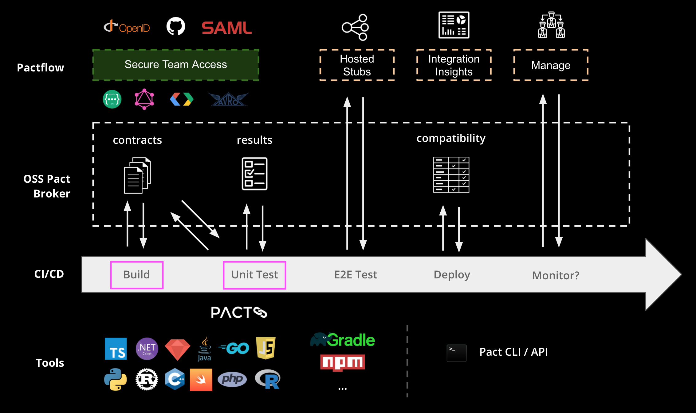

If you've made it this far, you should now have a basic understanding of how Pact and Pactflow work together to make it safe to release software into production quickly and reliably.

## Next Steps?

1. Ensure the `editor` tab is open
2. Click on a filename(s) below to copy it
3. Click into the editor window and press `ctrl+p` or `command+p` to search for a file
4. Press `ctrl+v` or `command+v` to paste the filename and select the file from the list

Here are a few things to try to change in `/root/example-provider-springboot/src/main/java/com/example/springboot/Product.java`{{copy}} to see what scenarios Pact can help you with:

1.  Try changing the provider code in a backwards incompatible way, what happens?

    - First try commenting out the 'name' key in the Product constructor, then run: `./gradlew clean test`{{execute}}
    - This should fail!

2.  Try changing the provider code in a way that won't break existing consumers, but in a traditional "backwards incompatible" way, what happens?
    - Try commenting out the 'version' key in the Product constructor, then run:
      `./gradlew clean test`{{execute}}
    - This should _not_ fail - no consumers need this field!

## The bigger picture

Zooming out a little, Pact (and Pactflow) will be used throughout your entire SDLC. Today, we learned how Pact can be run locally. However, Pact tests should laso be run during the test phase of a CI/CD pipeline:

- The Pact framework is used as a testing library as per any other unit testing framework - e.g. JUnit, TestNG etc.
- During the Build and Test phases of your pipeline, you will use language specific tools and frameworks to author and run your Pact tests. In this example, we used JUnit + Pact
- Pact provides a set of [CLI Tools](https://docs.pact.io/implementation_guides/cli) to perform general tasks, such as publishing and tagging contracts, gating and managing deployments and more.
- Pactflow extends the capability of the Open Source Pact Broker by providing a reimagined user experience, teams and permissions management and a number of other [features](https://pactflow.io/features).

In future workshops, we'll dive further into how to integrate Pact into other stages of your pipeline.

## Further material

Learn about gating deployments with `can-i-deploy` by taking the next course: [https://killercoda.com/pactflow/scenario/pactflow-can-i-deploy-js](https://killercoda.com/pactflow/scenario/pactflow-can-i-deploy-js).

You may also be interested in one of our longer form [workshops](https://docs.pact.io/implementation_guides/workshops), or getting deeper into [CI/CD](https://docs.pactflow.io/docs/workshops/ci-cd/) with Pact.
