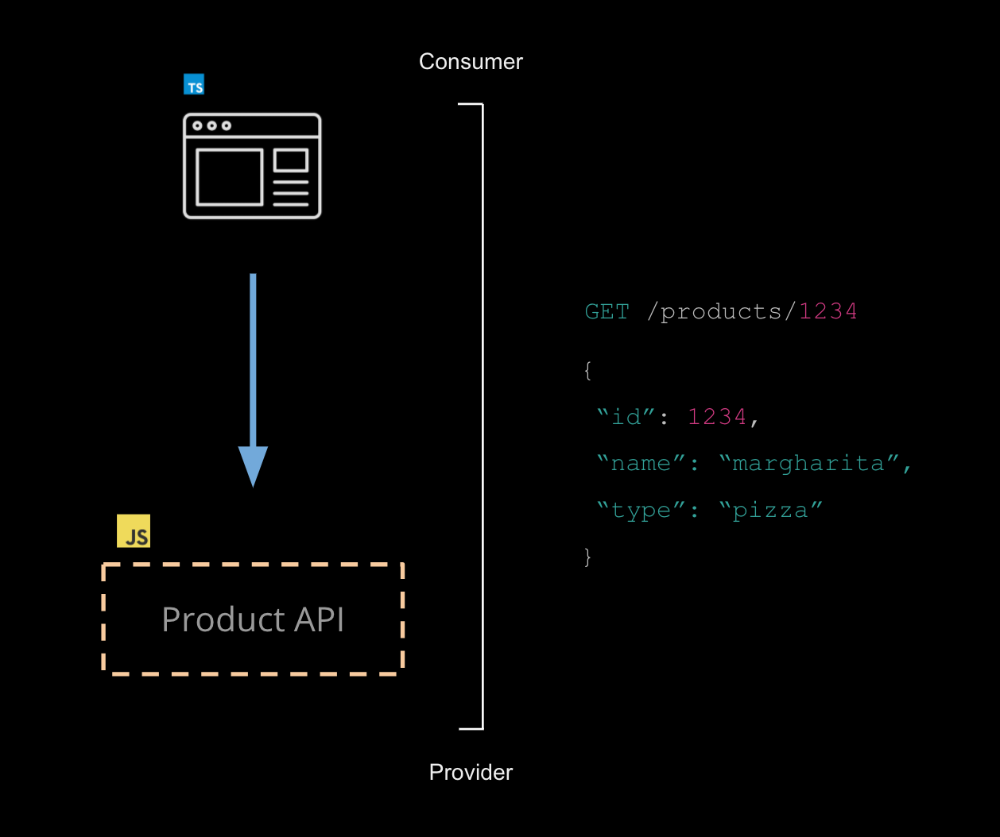

## An example scenario: Product API

To learn the basic concepts of Pact, we will work through an example scenario authoring a Pact test between a consumer (Product Web) and its provider (the Product API).

We will implement this system using an approach referred to as _consumer-driven contracts_, where we will first author the consumer code base before implementing the provider. You can think of this as form of TDD for APIs.

### Definitions

Let's get some terminology out of the way so we have a shared vocabulary:

* **Consumer**: An application that makes use of the functionality or data from another application to do its job. For applications that use HTTP, the consumer is always the application that initiates the HTTP request (eg. the web front end), regardless of the direction of data flow. For applications that use queues, the consumer is the application that reads the message from the queue.
* **Provider**: An application (often called a service) that provides functionality or data for other applications to use, often via an API. For applications that use HTTP, the provider is the application that returns the response. For applications that use queues, the provider (also called producer) is the application that writes the messages to the queue.

A **contract** between a consumer and provider is called a *pact*. Each pact is a collection of interactions which describe how the consumer expects the provider to behave.

_The first step in writing a pact test is to describe this interaction, which we do by creating a consumer test._

### Further Reading

You can read more about this here: https://docs.pact.io/getting_started/how_pact_works