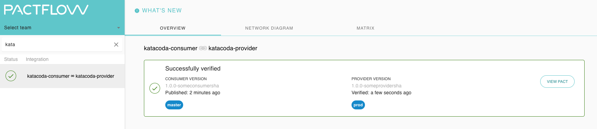

# Testing (Verify) the provider

Now that we published our contract, we can have the provider verify it each time the provider build runs, to prevent introducing breaking changes to their consumers. This is referred to as "provider verification".

_NOTE: Credentials from the previous step will be required for this step to run._

#### Run the Provider tests

This step involves the following:

1. Starting the API
2. Telling Pact to use the contracts stored in Pactflow and where the Product API will be running
3. Running the Provider verification task

Create our Provider pact test file `provider.pact.spec.js`:

```js
echo '
const { Verifier } = require("@pact-foundation/pact");
const { server } = require("./provider");

describe("Pact Verification", () => {
// (1) Starting the Provider API
before((done) => server.listen(8081, done));

it("validates the expectations of ProductService", () => {
// (2) Telling Pact to use the contracts stored in Pactflow and where the Product API will be running
const opts = {
logLevel: "INFO",
providerBaseUrl: "http://localhost:8081",
providerVersion: "1.0.0-someprovidersha",
provider: "katacoda-provider-v3",
consumerVersionSelectors: [{ mainBranch: true }],
pactBrokerUrl: process.env.PACT_BROKER_BASE_URL,
// pactUrls: [
// `${process.env.PWD}/pacts/katacoda-consumer-katacoda-provider.json`,
// ],
publishVerificationResult: true,
enablePending: true,
};
// (3) Running the Provider verification task
return new Verifier(opts).verifyProvider().then((output) => {
console.log("Pact Verification Complete!");
console.log(output);
});
});
});' > provider.pact.spec.js
```{{exec}}

And then run it: `npm run test:provider`{{execute}}

## Check

Your dashboard should look something like this, showing the pact as verified (you can ignore any tags applied for now).

