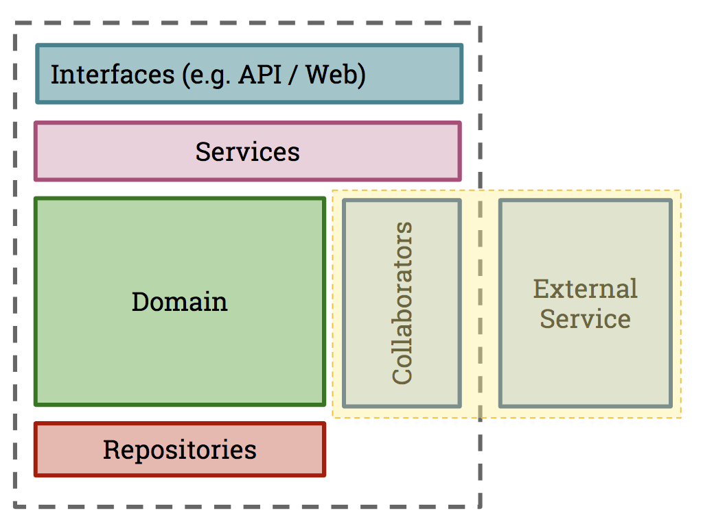

## The Consumer

Time to create our consumer code base.

In our project, we're going to need:

- A model (the `Product` class) to represent the data returned from the Product API
- A client (the `ProductApiClient`) which will be responsible for making the HTTP calls to the Product API and returning an internal representation of an Product.

Note that to create a Pact test, you do need to write the code that executes the HTTP requests to your service (in your client class), but you don't need to write the full stack of consumer code (eg. the UI).

### Scope of a Consumer Pact Test

Ideally, the Pact tests should be a unit test for your API client class, and they should just focus on ensuring that the request creation and response handling are correct. If you use pact for your UI tests, you'll end up with an explosion of redundant interactions that will make the verification process tedious. Remember that pact is for testing the contract used for communication, and not for testing particular UI behaviour or business logic.

Usually, your application will be broken down into a number of sub-components, depending on what type of application your consumer is \(e.g. a Web application or another API\). This is how you might visualise the coverage of a consumer Pact test:



Here, a _Collaborator_ is a component whose job is to communicate with another system. In our case, this is the `API` class communicating with the external `Product API` system. This is what we want our consumer test to inspect.

### Create a new Project

> <strong>When using the visual editor</strong> it's not possible yet to click-exec code into the Editor tab, but it's
> already planned for a future update. Till then, all exec will be automatically switched to copy when using the visual editor, so you should switch to a tab when prompted

1. Switch to Tab 1
2. Clicking on the code block when prompted
3. This should create a new file in your workspace
4. You can switch to the editor tab
5. Click the filename above to copy.
6. Ensure the `editor` tab is open
7. press `ctrl+p` or `command+p` to search for a file
8. Press `ctrl+v` or `command+v` to paste the filename and select the file from the list
9. You will now be able to see your newly created file

We'll use this approach moving forward as we progress through the workshop.

We need two dev dependencies to run our pact tests:

1. Mocha to use as our unit testing framework (we are also using Chai.js for assertions)
2. Pact for our API assertions

We have some other dependencies for our Provider and some additional scripts which can be ignored for now.

Switch to `Tab 1` and click on the code block below to create filename: `package.json`:

```js
echo '{
  "name": "pactflow-getting-started-js",
  "version": "0.1.0",
  "dependencies": {
    "axios": "^0.19.1",
    "cors": "^2.8.5",
    "express": "^4.17.1"
  },
  "scripts": {
    "test:consumer": "mocha --exit --timeout 30000 consumer.pact.spec.js",
    "test:provider": "mocha --exit --timeout 30000 provider.pact.spec.js",
    "publish": "npx pact-broker publish ./pacts --consumer-app-version 1.0.0-someconsumersha --tag master"
  },
  "devDependencies": {
    "@pact-foundation/pact": "^9.17.3",
    "chai": "^4.2.0",
    "mocha": "^8.1.3"
  }
}' > package.json
```{{exec}}

Switch to Tab 1 and Install the dependencies for the project: `npm i`{{execute}}

(click on the highlighted command above to run `npm i` automatically in the terminal window to the right. Again, look out for these as we progress through the workshop)

### Create our Product Model

Now that we have our basic project, let's create our `Product` domain model:


Switch to `Tab 1` and click on the code block below to create filename: `product.js`:

```js
echo 'class Product {
  constructor(id, name, type) {
    this.id = id;
    this.name = name;
    this.type = type;
  }
}
module.exports = {
  Product,
}' > product.js;
```{{exec}}

### Create our Product API Client

Lastly, here is our API client code. This code is responsible for fetching products from the API, returning a `Product`:


Switch to `Tab 1` and click on the code block below to create filename: `api.js`:

```js
echo 'const axios = require("axios");
const { Product } = require("./product");

class ProductApiClient {
  constructor(url) {
    this.url = url;
  }

  async getProduct(id) {
    return axios
      .get(`${this.url}/products/${id}`)
      .then((r) => new Product(r.data.id, r.data.name, r.data.type));
  }
}
module.exports = {
  ProductApiClient,
};' > api.js
```{{exec}}

This class, and specifically the `getProduct()` method, will be the target of our Pact test.

### Check

Before moving to the next step, check the following:

1. There is a file called `package.json` in your editor
1. You have run `npm i`{{execute}} and the dependencies have been installed
1. There is a file called `product.js` in your editor
1. There is a file called `api.js` in your editor
